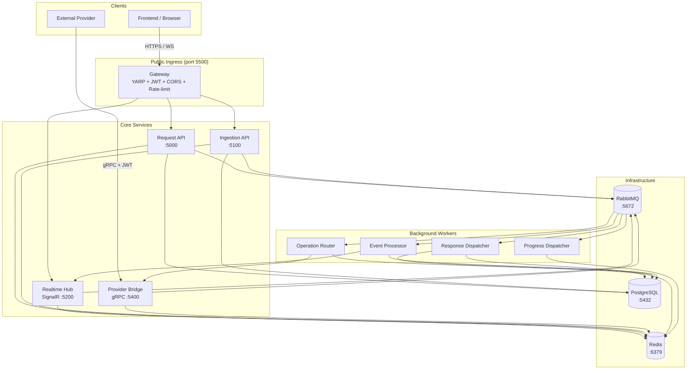

# Realtime Reporting Platform (HDOS)

A multi-tenant, event-driven reporting platform built on .NET 9. Providers register dashboards and supply data via gRPC; users submit requests through an authenticated gateway and receive real-time progress and results over SignalR or SSE.

---

## Architecture



**Data flow (happy path):**
1. Frontend sends `POST /api/v1/requests` through the Gateway (JWT authenticated).
2. Request API persists the request and publishes `OperationRequested` to RabbitMQ.
3. Operation Router picks up the message, routes to Provider Bridge (gRPC).
4. Provider Bridge forwards to the matching external provider; streams progress events back.
5. Progress Dispatcher fans progress out to Realtime Hub → SignalR push to all connected browser tabs.
6. On completion, Response Dispatcher persists the result and pushes `RequestCompleted` via SignalR.

---

## Quickstart

### Prerequisites

- Docker Desktop (or equivalent) with Compose V2
- .NET 9 SDK (for local development and running tests)

### Run the full stack

```bash
# Clone and start all services + infrastructure
git clone <repo-url>
cd HDOS

# Start infrastructure + all 9 platform services
docker compose up -d

# (Optional) start provider simulators
docker compose -f docker-compose.yml -f docker-compose.providers.yml up -d
```

Services start in dependency order. PostgreSQL, Redis, and RabbitMQ start first; gateway starts last after all downstream services are healthy.

### Port map

| Port | Service | Notes |
|------|---------|-------|
| 5500 | Gateway | Public entry point — all frontend traffic goes here |
| 5000 | Request API | Internal (accessible via gateway at `/api/v1/requests`) |
| 5100 | Ingestion API | Internal (accessible via gateway at `/api/v1/events`) |
| 5200 | Realtime Hub | Internal (accessible via gateway at `/hubs/main`) |
| 5400 | Provider Bridge | gRPC — providers connect here directly |
| 5432 | PostgreSQL | |
| 6379 | Redis | |
| 5672 | RabbitMQ | AMQP |
| 15672 | RabbitMQ | Management UI |

### Environment variables (top-level)

| Variable | Default | Description |
|----------|---------|-------------|
| `AUTH_AUTHORITY` | _(empty — development mode)_ | OIDC authority URL. Empty disables JWT validation. |
| `AUTH_AUDIENCE` | `reporting-platform` | Expected JWT audience claim |
| `CORS_ORIGIN_0` | `http://localhost:3000` | First allowed CORS origin |
| `CORS_ORIGIN_1` | `http://localhost:5173` | Second allowed CORS origin (Vite dev server) |

---

## Running Tests

```bash
# Run all unit and integration tests
dotnet test

# Run a specific project
dotnet test tests/Gateway.Tests
dotnet test tests/Ingestion.Tests

# Run with verbose output
dotnet test --logger "console;verbosity=normal"
```

**Test suite composition (239 tests):**

| Project | Tests | Notes |
|---------|-------|-------|
| Gateway.Tests | 43 | Includes GW1–GW9 integration tests with YARP backend stubs |
| Ingestion.Tests | 12 | IN1–IN9 unit + WebApplicationFactory integration tests |
| Operations.Tests | 35 | |
| Transformers.Tests | 34 | |
| ProviderBridge.Tests | 36 | |
| Resolver.Tests | 24 | 1 skip: PH4 requires PostgreSQL (Testcontainers) |
| Adapters.Tests | 15 | 1 skip: SI2 requires live Provider.Bridge |
| Providers.Tests | 15 | 2 skips: T7/T8 require PostgreSQL + Redis (Testcontainers) |
| ProviderSdk.Tests | 13 | 1 skip: SI1 requires bridge + infrastructure |
| QueryBuilder.Tests | 5 | |
| Router.Tests | 7 | |

Skipped tests require Docker and are verified via the E2E smoke test suite.

---

## Project Layout

```
HDOS/
├── Services/               # 9 deployable services
│   ├── Gateway/            # YARP reverse proxy — public ingress
│   ├── Request.Api/        # Dashboard request lifecycle
│   ├── Ingestion.Api/      # External event ingestion
│   ├── Realtime.Hub/       # SignalR hub
│   ├── Provider.Bridge/    # gRPC bridge to external providers
│   ├── Operation.Router.Worker/    # Routes requests → providers
│   ├── Response.Dispatcher.Worker/ # Persists + pushes results
│   ├── Progress.Dispatcher.Worker/ # Fans out progress events
│   └── Event.Processor.Worker/    # Processes ingested events
│
├── Shared/                 # Libraries shared across services
│   ├── Auth/               # JWT validation helpers
│   ├── Contracts/          # MassTransit message contracts
│   ├── HubContracts/       # SignalR hub method names
│   ├── Messaging/          # MassTransit setup helpers
│   ├── Metadata/           # Dashboard/tenant metadata
│   ├── Adapters/           # SQL + external adapter interfaces
│   ├── ProviderSdk/        # .NET SDK for building providers
│   ├── Providers/          # Provider registry and resolution
│   ├── QueryBuilder/       # SQL query construction
│   ├── Resolver/           # Dashboard resolver logic
│   ├── Transformers/       # Response transformation pipeline
│   ├── Operations/         # Operation orchestration
│   ├── Caching/            # Redis cache abstractions
│   └── Telemetry/          # OpenTelemetry setup
│
├── tests/                  # Test projects (mirror Services + Shared)
├── docs/                   # Architecture docs, protocol specs, decisions
│   ├── PROTOCOL.md         # Frontend integration guide
│   ├── PROVIDER_PROTOCOL.md # Provider integration guide
│   ├── DECISIONS.md        # Architecture decision record
│   └── RENDER_CONTRACTS.md # Dashboard render contract spec
├── db/
│   └── Migrations/         # PostgreSQL migration scripts (V001–V008)
├── proto/
│   └── provider.proto      # gRPC service definition
├── samples/
│   ├── DotnetProviderSample/  # .NET provider SDK example
│   └── PythonProviderSample/  # Python gRPC provider example
├── docker-compose.yml
├── docker-compose.providers.yml
└── Directory.Build.props   # NuGet audit + CVE override settings
```

---

## Key Documentation

| Document | Audience | Contents |
|----------|----------|----------|
| [docs/PROTOCOL.md](docs/PROTOCOL.md) | Frontend teams | Complete frontend integration guide — auth, SignalR, SSE, request lifecycle |
| [docs/PROVIDER_PROTOCOL.md](docs/PROVIDER_PROTOCOL.md) | Provider teams | gRPC contract, JWT format, streaming protocol, error codes |
| [docs/DECISIONS.md](docs/DECISIONS.md) | All engineers | Architecture decision record — why non-obvious choices were made |
| [docs/RENDER_CONTRACTS.md](docs/RENDER_CONTRACTS.md) | Frontend + provider teams | Dashboard render contract JSON schema |
| [docs/PROVIDER_ONBOARDING.md](docs/PROVIDER_ONBOARDING.md) | New provider teams | Step-by-step provider onboarding guide |

---

## Security Notes

- **JWT validation** is enforced at the gateway for all `api/` and `hubs/` routes. Configure `AUTH_AUTHORITY` and `AUTH_AUDIENCE` to match your OIDC provider.
- **Tenant isolation** is enforced by extracting `tenant_id` from JWT claims at every service boundary. The claim is never trusted from request bodies.
- **gRPC (Provider Bridge)** uses JWT authentication. Providers must send a signed JWT with `sub` matching their registered `providerId`.
- **Rate limiting** is applied at both the gateway (global per-IP) and per service (per-tenant).
- **Secrets**: `clientSecret` is stored as a bcrypt hash (cost factor 12) and returned in plaintext only at registration time.
- Set `AUTH_AUTHORITY` to a non-empty value in production. Empty authority disables JWT signature validation (development only).

---

## Development

### Database migrations

Migrations are plain SQL files in `db/Migrations/`. In Docker Compose, they are applied automatically via the `postgres` init volume. For local development against a live Postgres instance:

```bash
# Apply all migrations in order
for f in db/Migrations/V*.sql; do psql -h localhost -U hdos -d hdos -f "$f"; done
```

### Adding a new service

1. Create a new project under `Services/`.
2. Add a `Dockerfile` using the multi-stage build pattern from an existing service.
3. Add the service to `docker-compose.yml`.
4. Add a test project under `tests/` mirroring the service name.

### Proto changes

Edit `proto/provider.proto` then regenerate gRPC stubs:

```bash
dotnet build Shared/ProviderSdk   # triggers protoc via Grpc.Tools
```

---

## License

Internal — not for external distribution.
