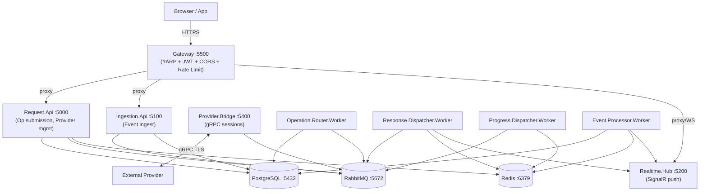

# PHASE_12_PLAN.md — Final Validation Gate
> Status: APPROVED | Author: Claude Sonnet 4.6 | Date: 2026-05-20 | Approved: 2026-05-20

Final phase. No new product features. Goals: execute all deferred integration tests, verify the full
stack boots and routes correctly end-to-end, close documentation, and declare the project complete.

---

## Table of Contents

1. [§12.1 Deferred Integration Tests](#121-deferred-integration-tests)
2. [§12.2 E2E Smoke Tests via Docker Compose](#122-e2e-smoke-tests-via-docker-compose)
3. [§12.3 Production Readiness Checklist](#123-production-readiness-checklist)
4. [§12.4 Documentation Final Pass](#124-documentation-final-pass)
5. [§12.5 Optional Polish](#125-optional-polish)
6. [§12.6 Open Questions](#126-open-questions)
7. [§12.7 Ship Criteria](#127-ship-criteria)
8. [§12.8 Execution Order](#128-execution-order)

---

## §12.1 Deferred Integration Tests

### Inventory

| ID | Test name | File | Body | Infrastructure | Work |
|----|-----------|------|------|---------------|------|
| T7 | `T7_RedisPubSubTriggersReload` | `tests/Providers.Tests/Registry/ProviderRegistryTests.cs` | Written | Redis Testcontainers | Un-skip; run |
| T8 | `T8_InvalidSchemaInDb_GracefulSkip_ValidRegistrationsReachable` | `tests/Providers.Tests/Registry/OperationRegistryReloadTests.cs` | Written | Postgres Testcontainers | Un-skip; run |
| PH4 | `DashboardResolver_PostgresAdapter_RealQuery` | `tests/Resolver.Tests/Core/DashboardResolverTests.cs` | Needs writing | Postgres Testcontainers | Write body + un-skip |
| IN4 | `IN4_RateLimit_ExceedTenantQuota_Returns429_WithRetryAfter` | `tests/Ingestion.Tests/Controllers/EventIngestionControllerTests.cs` | Stub | WebApplicationFactory | Rewrite as integration test |
| IN9 | `IN9_JwtScope_MissingIngestionScope_Returns403` | `tests/Ingestion.Tests/Controllers/EventIngestionControllerTests.cs` | Stub | WebApplicationFactory | Rewrite as integration test |
| IN12 | `IN12_DashboardDeleted_OrphanSubscriptionsRemoved` | `tests/Ingestion.Tests/Workers/EventProcessorServiceTests.cs` | Stub | Postgres Testcontainers | Write body |
| GW1 | `GW1_Route_Requests_ForwardedToRequestApi` | `tests/Gateway.Tests/Gateway/GatewayTests.cs` | Stub | Backend stub server | Write stub + body |
| GW2 | `GW2_Route_Events_ForwardedToIngestionApi` | `tests/Gateway.Tests/Gateway/GatewayTests.cs` | Stub | Backend stub server | Write stub + body |
| GW3 | `GW3_Route_Hub_WebSocketUpgrade_Proxied` | `tests/Gateway.Tests/Gateway/GatewayTests.cs` | Stub | Backend stub server | Write stub + body |
| GW4 | `GW4_Route_Sse_ResponseBufferingDisabled` | `tests/Gateway.Tests/Gateway/GatewayTests.cs` | Stub | Backend stub server | Write stub + body |
| GW6 | `GW6_JWT_Valid_ClaimsForwarded_AsHeaders` | `tests/Gateway.Tests/Gateway/GatewayTests.cs` | Stub | Backend stub server | Write stub + body |
| GW9 | `GW9_RateLimit_GlobalIpFlood_Returns429` | `tests/Gateway.Tests/Gateway/GatewayTests.cs` | Stub | Concurrent load test | Write body |
| SI1 | `SI1_EndToEnd_ProviderServesRequest_ResponseOnSignalR` | `tests/ProviderSdk.Tests/IntegrationTests.cs` | Stub | Full docker compose stack | Write body |
| SI2 | `SI2_Integration_RealBridgeAndProvider_EndToEnd` | `tests/Adapters.Tests/ExternalProviderAdapterTests.cs` | Stub | Full docker compose stack | Write body |

**Total: 14 deferred tests. All must pass.**

---

### §12.1a — WebApplicationFactory tests (no Docker required)

**IN4 — Rate limit middleware test**

Current stub (unit test) cannot test ASP.NET Core rate-limiting middleware. Rewrite as
`WebApplicationFactory<Program>` integration test in `Ingestion.Tests`:

```csharp
// Approach: WebApplicationFactory<ReportingPlatform.IngestionApi.Program>
// Configure rate limit to 2 requests/min in test override.
// Send 3 requests with the same JWT → assert 3rd returns 429 + Retry-After header.
// Test class: EventIngestionIntegrationTests (new file in tests/Ingestion.Tests/Integration/)
```

Implementation notes:
- `Ingestion.Api/Program.cs` already has `public partial class Program { }` — check if present; add if not
- Override `Ingestion:RateLimits:Default` to `2` via `UseSetting` in `WithWebHostBuilder`
- Provide a mock JWT via `Authorization: Bearer <test-jwt>` header (no real JWKS needed in dev mode)
- Disable `RequireHttpsMetadata` already true in Development
- Override `Auth:Authority` to a dummy value; disable OIDC metadata fetch
- NuGet required in `Ingestion.Tests.csproj`: `Microsoft.AspNetCore.Mvc.Testing` (already present)

**IN9 — JWT scope enforcement**

Rewrite as integration test with `WebApplicationFactory<Program>`:

```csharp
// Send request with valid JWT but no "ingestion" scope claim.
// Assert 403 Forbidden.
// JWT can be a hand-crafted HS256 token (not RS256) in test mode.
// Alternatively: configure JwtBearer with a test symmetric key via UseSetting.
```

Implementation notes:
- Use `Microsoft.IdentityModel.Tokens.SymmetricSecurityKey` + `HmacSha256` in test
- Override `Auth:Authority` to disable OIDC metadata discovery
- Generate test token without `scope` claim
- Assert response is 403

---

### §12.1b — Backend stub tests (GW1–GW4, GW6, GW9)

**Strategy: in-process stub HTTP servers via `Microsoft.AspNetCore.TestHost`**

YARP proxies to real HTTP addresses — it cannot intercept `HttpMessageHandler`. The cleanest
approach for gateway proxy tests is to start a `WebApplication` stub on a dynamic port (`:0`),
capture the assigned port, and override YARP cluster destinations in `WithWebHostBuilder`.

```csharp
// Pattern in GatewayTests:
private static async Task<(WebApplication App, int Port)> StartStubAsync(
    Func<HttpContext, Task> handler)
{
    var builder = WebApplication.CreateBuilder();
    builder.WebHost.UseUrls("http://127.0.0.1:0"); // OS assigns free port
    var stub = builder.Build();
    stub.Run(handler);
    await stub.StartAsync();
    var port = ((IPEndPoint)stub.Services
        .GetRequiredService<IServer>()
        .Features.Get<IServerAddressesFeature>()!
        .Addresses
        .Select(a => new Uri(a))
        .First()
        .Port);
    return (stub, port);
}
```

Override YARP destinations in `WithWebHostBuilder`:
```csharp
builder.ConfigureServices(services =>
{
    services.PostConfigure<YarpReverseProxyOptions>(opts =>
    {
        // Override cluster addresses to point at stub ports
    });
});
```

**GW1** — `GET /api/v1/requests/req-123` forwarded to request-api stub → stub returns 200 JSON  
**GW2** — `POST /api/v1/events` forwarded to ingestion-api stub → stub returns 201  
**GW3** — WebSocket upgrade: stub responds to `101 Switching Protocols`; assert YARP forwards upgrade  
**GW4** — SSE route: stub returns `text/event-stream`; assert gateway response has `X-Accel-Buffering: no`  
**GW6** — Stub captures `X-Tenant-Id`, `X-User-Id`, `X-Token-Scope` headers; assert they match JWT claims

**GW9 — Rate limit load test (no backend needed)**

Send `PermitLimit + 1` concurrent requests to `/health` (unauthenticated, rate-limited by IP).
Override `GlobalIp` limit to `5` in `WithWebHostBuilder`. Assert at least one response is 429.

```csharp
var tasks = Enumerable.Range(0, 10)
    .Select(_ => _client.GetAsync("/health"));
var responses = await Task.WhenAll(tasks);
Assert.Contains(responses, r => r.StatusCode == HttpStatusCode.TooManyRequests);
```

---

### §12.1c — Testcontainers tests (T7, T8, PH4, IN12)

**Prerequisites for all Testcontainers tests:**
- Docker Desktop running on host
- `Testcontainers.PostgreSql` and `Testcontainers.Redis` already present in `Providers.Tests.csproj`
- Add `Testcontainers.PostgreSql` to `Ingestion.Tests.csproj` and `Resolver.Tests.csproj`

**T7** (`ProviderRegistryTests`) — Body already written. Un-skip by removing `[Fact(Skip=...)]`.  
**T8** (`OperationRegistryReloadTests`) — Body already written. Un-skip.  
Run command: `dotnet test tests/Providers.Tests/ --filter "RequiresDocker=true"`

**PH4 — DashboardResolver_PostgresAdapter_RealQuery**

Write test body in `tests/Resolver.Tests/Core/DashboardResolverTests.cs`:

```csharp
// 1. Start PostgreSQL container → apply migrations V001–V008 via Npgsql direct SQL
// 2. Seed: one queryable_sources row (SqlQueryBuilder type), one dashboard_definitions row
//    with one widget referencing that datasource
// 3. Build DashboardResolver with real SqlQueryBuilderAdapter + real Postgres NpgsqlDataSource
// 4. Call RenderAsync("t1", "test_dash", filters={})
// 5. Assert: result.Widgets.Length == 1, result.Widgets[0].Error == null, rows.Count >= 0
```

Key design: skip the full Flyway toolchain — apply migrations directly via `NpgsqlConnection.Execute`
reading the SQL files from `../../db/Migrations/V001__*.sql` relative to the test assembly.

**IN12 — Dashboard delete CASCADE**

Write test body in `tests/Ingestion.Tests/Workers/EventProcessorServiceTests.cs`:

```csharp
// 1. Start PostgreSQL container → apply V008 migration
// 2. INSERT into dashboard_definitions (tenantId="t1", dashboardCode="sales")
// 3. INSERT into event_subscriptions (t1, "order.shipped", "sales", "w1")
// 4. DELETE from dashboard_definitions WHERE tenant_id='t1' AND dashboard_code='sales'
// 5. SELECT COUNT(*) FROM event_subscriptions WHERE dashboard_code='sales'
// 6. Assert count == 0 (FK CASCADE deleted the orphan rows)
```

---

### §12.1d — Full Docker compose stack (SI1, SI2)

These require all infrastructure + at least 2 services running. Recommended approach:
use `Testcontainers.Compose` or bring up the stack manually before running tests.

**SI1 — Provider SDK E2E (ProviderSdk.Tests)**

**Decision: Option B — Bridge connectivity only** (Patch 1).
Full SignalR assertion via `WebApplicationFactory` is deferred; coverage is provided by
§12.2 scenario 2 (external provider docker-compose E2E), which is a **non-negotiable ship gate**
(see §12.7 criterion 11). Without scenario 2 executing and passing, SignalR fan-out is unverified
end-to-end.

```csharp
// 1. Testcontainers: Postgres, RabbitMQ, Redis
// 2. WebApplicationFactory: Request.Api + Provider.Bridge (in-process via two separate factories)
// 3. Register a provider via Request.Api admin endpoint
// 4. ProviderClient.ConnectAsync() → assert connection established (gRPC Hello exchanged)
// 5. Submit a synthetic operation request → assert ProviderClient.OnRequest fires
// 6. Provider returns result → assert Request.Api result store has a terminal record
// Note: SignalR fan-out verification is covered by §12.2 scenario 2 (docker-compose E2E).
//       If scenario 2 is not executed, SignalR end-to-end is unverified — do not ship.
```

Requires: `Testcontainers.RabbitMq` NuGet package added to `ProviderSdk.Tests.csproj`.

**SI2 — External Provider Adapter E2E (Adapters.Tests)**

Scope: verify real gRPC submission + result retrieval without full docker stack:

```csharp
// Use WireMock.Net or an in-process stub gRPC server to simulate Provider.Bridge.
// Alternatively: start Provider.Bridge via WebApplicationFactory (gRPC TestServer).
// Submit a request via ExternalProviderAdapter → stub responds with result → assert rows returned.
```

If writing the gRPC stub is too complex for Phase 12 scope: mark SI2 as
`[Fact(Skip="Requires live Provider.Bridge gRPC server — validate manually via docker-compose")]`
and document it as a known limitation, covering the gap with E2E smoke test §12.2 scenario 2.

---

## §12.2 E2E Smoke Tests via Docker Compose

### Prerequisites

**Timing constraint** (Patch 2): each scenario must complete within 30 seconds. Total smoke run
must finish under 5 minutes. Scenarios that require waiting (e.g., polling) use a 30s timeout
with early exit on success. The 60-second grace period in scenario 4 is explicitly NOT waited.

**Dockerfiles** — `docker-compose.yml` references `Dockerfile` per service. All must be created.
Standard multi-stage template for each ASP.NET Core service:

```dockerfile
# Services/{ServiceName}/Dockerfile
FROM mcr.microsoft.com/dotnet/sdk:9.0 AS build
WORKDIR /src
COPY . .
RUN dotnet publish Services/{ServiceName}/{ServiceName}.csproj \
    -c Release -o /app --no-self-contained

FROM mcr.microsoft.com/dotnet/aspnet:9.0
WORKDIR /app
COPY --from=build /app .
ENTRYPOINT ["dotnet", "{AssemblyName}.dll"]
```

Services requiring Dockerfiles (7 web/worker services):

| Service | Dockerfile path | Assembly name |
|---------|----------------|---------------|
| Request.Api | `Services/Request.Api/Dockerfile` | `ReportingPlatform.Request.Api.dll` |
| Realtime.Hub | `Services/Realtime.Hub/Dockerfile` | `ReportingPlatform.Realtime.Hub.dll` |
| Gateway | `Services/Gateway/Dockerfile` | `ReportingPlatform.Gateway.dll` |
| Ingestion.Api | `Services/Ingestion.Api/Dockerfile` | `ReportingPlatform.Ingestion.Api.dll` |
| Provider.Bridge | `Services/Provider.Bridge/Dockerfile` | `ReportingPlatform.Provider.Bridge.dll` |
| Event.Processor.Worker | `Services/Event.Processor.Worker/Dockerfile` | `ReportingPlatform.Event.Processor.Worker.dll` |
| Operation.Router.Worker | `Services/Operation.Router.Worker/Dockerfile` | `ReportingPlatform.Operation.Router.Worker.dll` |
| Response.Dispatcher.Worker | `Services/Response.Dispatcher.Worker/Dockerfile` | `ReportingPlatform.Response.Dispatcher.Worker.dll` |
| Progress.Dispatcher.Worker | `Services/Progress.Dispatcher.Worker/Dockerfile` | `ReportingPlatform.Progress.Dispatcher.Worker.dll` |

**Migrations** — The `postgres` service in `docker-compose.yml` bind-mounts `./db/Migrations/`
to `/docker-entrypoint-initdb.d/`. PostgreSQL executes `*.sql` files alphabetically on first boot.
This covers V001–V008. Verify order: `ls db/Migrations/` must show V001 through V008 in order.

**Auth** — For local smoke tests, set `AUTH_AUTHORITY=` (empty) and configure all services with
`Auth:RequireHttpsMetadata=false` and a shared symmetric key test JWT. Gateway can be configured
with a permissive JWKS mode for local smoke tests.

### Startup Sequence

```bash
# 1. Build all images
docker compose build

# 2. Start infrastructure first
docker compose up -d postgres redis rabbitmq

# 3. Wait for health checks
docker compose wait postgres redis rabbitmq

# 4. Start platform services
docker compose up -d request-api realtime-hub ingestion-api \
                    operation-router-worker response-dispatcher-worker \
                    progress-dispatcher-worker event-processor-worker provider-bridge

# 5. Start gateway last (depends on all backends healthy)
docker compose up -d gateway

# 6. Wait for full health
docker compose ps   # all should show "healthy" or "running"
curl -sf http://localhost:5500/health | jq .
```

### Smoke Test Script: `scripts/smoke-tests.sh`

Write `scripts/smoke-tests.sh` covering all 5 scenarios defined in the Phase 12 goals.
The script uses `curl`, `websocat` (for WebSocket), and `jq`. Each scenario is a function
that returns 0 on success and 1 on failure. Summary line at end: `N/5 scenarios passed`.

**Scenario 1 — Dashboard render (internal SQL adapter)**

```bash
smoke_dashboard_render() {
    # 1a. Create datasource via POST /api/v1/admin/datasources
    # 1b. Create dashboard via POST /api/v1/admin/dashboards
    # 1c. Submit dashboard.render request
    # 1d. Poll GET /api/v1/requests/{id}/result until status=Done (timeout 30s)
    # 1e. Assert result.widgets[0].error == null
}
```

**Scenario 2 — External provider render**

```bash
smoke_external_provider() {
    # 2a. Start DotnetProviderSample container (docker compose -f docker-compose.providers.yml)
    # 2b. Register provider via admin API
    # 2c. Create external_provider datasource
    # 2d. Submit render, poll result, assert response from provider
}
```

**Scenario 3 — Event ingestion → WidgetStale**

```bash
smoke_event_ingestion() {
    # 3a. Create dashboard with widget subscribed to "smoke.test.event"
    # 3b. Connect WebSocket client to SignalR hub (/hubs/main)
    # 3c. Subscribe to widget group
    # 3d. POST /api/v1/events with eventType=smoke.test.event
    # 3e. Assert WidgetStale notification received on WebSocket within 5s
}
```

**Scenario 4 — Provider credential lifecycle**

```bash
smoke_credential_lifecycle() {
    # 4a. Register provider (get clientId/secret)
    # 4b. Provider connects → asserts session established (GET /api/v1/admin/providers/{id}/status)
    # 4c. Rotate credentials (POST /api/v1/admin/providers/{id}/rotate)
    # 4d. Within 5s: verify old session STILL active (grace period invariant)
    #     AND verify new credentials return 401 when trying to auth with OLD secret
    # 4e. New connection with NEW secret succeeds (connect + assert session established)
    # NOTE: Full 60s grace-period expiry verification deferred to manual ops testing.
    #       Smoke test verifies rotation API correctness + token transition only.
}
```

**Scenario 5 — Multi-tab user fan-out**

```bash
smoke_fanout() {
    # 5a. Open 3 WebSocket connections (A, B, C) with same user JWT
    # 5b. Submit request from connection A
    # 5c. Close connection A before terminal arrives
    # 5d. Assert both B and C receive RequestCompleted push
    # 5e. GET result endpoint returns terminal record
}
```

---

## §12.3 Production Readiness Checklist

### §12.3.1 CVE Scan

#### §12.3.1.1 Version verification step (Patch 3)

**Before applying any override**, verify the suggested patch versions against current GHSA advisories:

```bash
# Check what vulnerable versions are currently resolved
dotnet list package --vulnerable --include-transitive --format json | jq \
  '.projects[].frameworks[].transitivePackages[]
   | select(.severity != null)
   | {id:.id, resolvedVersion:.resolvedVersion, severity:.severity, advisories:.advisories}'
```

For each vulnerable package, look up the GHSA advisory URL printed in the output and confirm
the **fixed-in** version. Use the highest patched version available at time of execution —
the version numbers below (`8.0.1`, `9.0.5`) are estimates based on current advisories and
**must be verified before committing**. Document the actual chosen versions in DECISIONS.md.

**Current finding**: Two transitive packages have known vulnerabilities:
- `System.IO.Packaging` 6.0.0 — HIGH (GHSA-f32c-w444-8ppv, GHSA-qj66-m88j-hmgj)
- `System.Security.Cryptography.Xml` 9.0.4 — HIGH (GHSA-37gx-xxp4-5rgx, GHSA-w3x6-4m5h-cxqf)

**Fix strategy**: Add explicit transitive overrides in affected `.csproj` files (or in a
`Directory.Packages.props`). Both are transitive-only — the consuming package chains them in:

```xml
<!-- In Directory.Packages.props or affected .csproj files -->
<!-- Override transitive System.IO.Packaging to non-vulnerable version -->
<PackageReference Include="System.IO.Packaging" Version="8.0.1" PrivateAssets="All" />
<!-- Override transitive System.Security.Cryptography.Xml to patched version -->
<PackageReference Include="System.Security.Cryptography.Xml" Version="9.0.5" />
```

After override: re-run `dotnet list package --vulnerable --include-transitive` across all projects.
Acceptance criterion: output must contain no advisory URLs.

**NuGetAudit mode**: Add to `Directory.Build.props` (or each `.csproj`):
```xml
<PropertyGroup>
  <NuGetAudit>true</NuGetAudit>
  <NuGetAuditMode>all</NuGetAuditMode>   <!-- catches transitive, not just direct -->
  <NuGetAuditLevel>moderate</NuGetAuditLevel>
</PropertyGroup>
```

### §12.3.2 TODO / FIXME Audit

Current count: **0** (confirmed by grep). Document in DECISIONS.md §Production readiness.

### §12.3.3 Migration Sequence Verification

Apply migrations V001–V008 on a clean database and verify no errors:

```bash
# Start a fresh Postgres container
docker run --rm -e POSTGRES_DB=hdos -e POSTGRES_USER=hdos -e POSTGRES_PASSWORD=hdos \
           -v $(pwd)/db/Migrations:/docker-entrypoint-initdb.d:ro \
           -p 5433:5432 postgres:16-alpine

# Verify all tables created
psql -h localhost -p 5433 -U hdos -d hdos -c "\dt"
# Expected: dashboard_definitions, datasource_definitions, event_schemas,
#           event_subscriptions, operation_registrations, providers,
#           queryable_sources, widget_results (+ any others from earlier migrations)

# Verify FK CASCADE on event_subscriptions
psql -h localhost -p 5433 -U hdos -d hdos -c "
  INSERT INTO dashboard_definitions(tenant_id, dashboard_code, title)
  VALUES ('t1','dash1','D1');
  INSERT INTO event_subscriptions(tenant_id, event_type, dashboard_code, widget_id)
  VALUES ('t1','order.shipped','dash1','w1');
  DELETE FROM dashboard_definitions WHERE dashboard_code='dash1';
  SELECT COUNT(*) FROM event_subscriptions WHERE dashboard_code='dash1';
  -- Must return 0
"
```

### §12.3.4 Docker Compose Full Stack Verification

```bash
docker compose up -d
sleep 30   # allow health checks to stabilise
docker compose ps  # verify all services "healthy" or at minimum "running"
curl -sf http://localhost:5500/health
# Expected: {"status":"healthy"} or HTTP 200
```

Services expected healthy: all 10 (postgres, redis, rabbitmq, gateway, request-api,
ingestion-api, realtime-hub, provider-bridge, operation-router-worker, event-processor-worker,
response-dispatcher-worker, progress-dispatcher-worker).

### §12.3.5 Final Test Count

Expected after Phase 12 deferred tests pass:
- Pre-Phase-12: 121 pass, 10 skip
- Phase 12 adds: 14 deferred → all pass, 0 skip
- Phase 12 may add: ~11 optional handler unit tests (§12.5)
- **Target total: ≥ 135 passing, 0 failing**

Skipped tests post-Phase-12: 0 (all previously-skipped tests pass or are formally withdrawn
with documented rationale).

### §12.3.6 RBAC Stub Documentation

`RequestSubmissionService` has a `// Step 2: RBAC stub` comment — real JWT claim extraction
deferred per DECISIONS.md. In Phase 12, add a DECISIONS.md entry formally accepting this as
a deferred item for a potential Phase 13 (auth hardening), and add a `TODO: Phase-13` tag.
This converts an implicit deferral to an explicit tracked decision.

---

## §12.4 Documentation Final Pass

### §12.4.1 README.md at Repo Root (NEW)

Create `README.md` with:

```markdown
# ReportingPlatform

[1-paragraph project overview]

## Quick Start

git clone ...
docker compose up -d
curl http://localhost:5500/health

## Architecture

[Mermaid diagram — see §12.4.3]

## Service Topology

| Service | Port | Role |
|---------|------|------|
| Gateway | 5500 | Public ingress — JWT, CORS, rate limiting, YARP |
| Request.Api | 5000 | Operation submission + provider management |
| Ingestion.Api | 5100 | Event ingestion |
| Realtime.Hub | 5200 | SignalR push |
| Provider.Bridge | 5400 | gRPC sessions for external providers |
| PostgreSQL | 5432 | Primary store |
| Redis | 6379 | Cache + pub/sub |
| RabbitMQ | 5672 | Message bus |

## Documentation Roadmap

| Document | Audience |
|----------|----------|
| PROTOCOL.md | Frontend developers — API contracts |
| PROVIDER_PROTOCOL.md | External provider teams — gRPC + SSE |
| PROVIDER_ONBOARDING.md | Provider operators — registration + secrets |
| RENDER_CONTRACTS.md | Frontend/charting — widget envelope schema |
| DECISIONS.md | Architects + reviewers — all 50+ ADRs |
| docs/PHASE_*_PLAN.md | Internal — implementation history |
```

### §12.4.2 Per-Service README.md

Create a short `README.md` in each `Services/{name}/` folder:

```markdown
# {ServiceName}

**Purpose**: [one sentence]
**Port**: [N] (dev) / [N] (docker)
**Dependencies**: PostgreSQL, Redis, RabbitMQ (as applicable)

## Endpoints

[table of HTTP/gRPC endpoints]

## Configuration

[key appsettings keys with defaults]

## Running locally

dotnet run --project Services/{ServiceName}/{ServiceName}.csproj
```

Services: Gateway, Request.Api, Ingestion.Api, Realtime.Hub, Provider.Bridge,
Event.Processor.Worker, Operation.Router.Worker, Response.Dispatcher.Worker,
Progress.Dispatcher.Worker.

### §12.4.3 Architecture Diagram (Mermaid)

Add to `README.md` (renders natively on GitHub):



### §12.4.4 DECISIONS.md Table of Contents

`DECISIONS.md` currently has 50+ decisions accumulated across phases without a ToC.
Add a navigable index at the top, grouped by phase:

```markdown
## Index

### Phase 2 — Core contracts & messaging
- [OQ-P2-A] Message bus choice (RabbitMQ vs Azure Service Bus) → §Phase-2
...

### Phase 11 — Ingestion + Gateway
- [OQ-P11-A] through [OQ-P11-F] → §Phase-11
- [X-Tenant-Id trust boundary invariant] → §Phase-11
```

### §12.4.5 Final Review Pass

Each of these 5 documents read top-to-bottom to verify:
- No broken internal `§` cross-references
- No `[TODO]` / `[TBD]` placeholder text
- Version numbers and port numbers consistent with implementation

| Document | Review checklist |
|----------|-----------------|
| `PROTOCOL.md` | All endpoint paths match controllers; status codes match implementations |
| `PROVIDER_PROTOCOL.md` | §18 late-progress added (Phase 11 ✓); gRPC proto matches `provider.proto` |
| `PROVIDER_ONBOARDING.md` | Registration flow matches Phase 8 implementation |
| `RENDER_CONTRACTS.md` | Widget envelope schema matches `WidgetEnvelope` C# record |
| `DECISIONS.md` | All 50+ decisions present; ToC added (§12.4.4) |

---

## §12.5 Optional Polish

Priority order — attempt in order, stop when time runs out:

### §12.5.1 Per-handler unit tests (highest value — improves coverage)

Phase 5 identified 11 handlers with no dedicated unit tests:
`OperationListHandler`, `OperationGetHandler`, `MetadataDashboardDeleteHandler`,
`MetadataDashboardGetHandler`, `MetadataDashboardListHandler`, `MetadataDatasourceUpsertHandler`,
`MetadataDatasourceDeleteHandler`, `MetadataDatasourceGetHandler`, `MetadataDatasourceListHandler`,
`WidgetExportHandler`, `OperationCancelHandler`.

Each test: 2–3 facts (happy path + missing-param error + idempotency/edge case).
Add to existing `tests/Operations.Tests/Handlers/` folder. Expected: +22–33 tests.

### §12.5.2 DLQ admin endpoints (Phase 6 OQ4 deferred)

Add to `Request.Api`:
- `GET /api/v1/admin/dlq` — list dead-letter queue messages (from RabbitMQ dead-letter exchange)
- `POST /api/v1/admin/dlq/{messageId}/requeue` — move message back to operation queue
- `DELETE /api/v1/admin/dlq/{messageId}` — permanent discard (with audit log)

Requires: admin authorization policy (`AdminScope`); bind RabbitMQ management HTTP API or use
MassTransit's management extensions. Low risk — read-only + idempotent requeue.

### §12.5.3 Wildcard SubscribesTo patterns (Phase 11 OQ-P11-B deferred)

Currently `WidgetDefinition.SubscribesTo` supports exact string match only.
Add `*` glob matching in `EventSubscriptionSyncService` and `EventProcessorService`:
- `"order.*"` → match `order.shipped`, `order.cancelled`, etc.
- Store the pattern as-is in `event_subscriptions.event_type`
- On lookup, use PostgreSQL `LIKE` or query with pattern expansion

Risk: query performance change — requires index analysis before implementing.

### §12.5.4 Parallel schema validation for batch ingestion (Phase 11 §1.5.1)

`EventIngestionController.IngestCoreAsync` validates events sequentially. For large batches,
parallelize with bounded concurrency:

```csharp
var semaphore = new SemaphoreSlim(Environment.ProcessorCount);
await Task.WhenAll(events.Select(async req =>
{
    await semaphore.WaitAsync(ct);
    try { ... } finally { semaphore.Release(); }
}));
```

Prerequisite: validate that schema validation is actually the bottleneck (p95 measurement).

### §12.5.5 Per-tenant ingestion token rotation UI

Admin endpoint `POST /api/v1/admin/ingestion-tokens/{tenantId}/rotate` returning new clientId +
hashed secret. Low priority — not in current ingestion flow.

---

## §12.6 Open Questions

| ID | Question | Default if not answered |
|----|----------|------------------------|
| OQ-P12-A | Is Docker available in the development environment for Testcontainers tests? | Assume yes; skip Testcontainers tests if Docker unavailable, document as known gap |
| OQ-P12-B | Backend stub strategy for GW1–4, GW6: in-process `WebApplication` with dynamic port, or WireMock.Net? | **In-process `WebApplication` with dynamic port** — no extra NuGet package |
| OQ-P12-C | SI1 scope: full SignalR assertion or bridge-connectivity only? | **Option B: Bridge-connectivity only** (Patch 1 — explicit decision). SignalR coverage gate = §12.2 scenario 2, which is a mandatory ship criterion (§12.7 #11). |
| OQ-P12-D | SI2 scope: in-process gRPC stub or mark formally withdrawn with E2E coverage note? | **In-process gRPC stub** preferred; if complex → formally withdraw with E2E note |
| OQ-P12-E | Architecture diagram format: Mermaid (GitHub renders) or ASCII? | **Mermaid** |
| OQ-P12-F | CVE threshold for ship gate: block on any severity, or high+ only? | **High+ blocks ship** — moderate/low documented but do not block |
| OQ-P12-G | Optional §12.5 scope: which items if time permits? | §12.5.1 (handler unit tests) first; §12.5.2 (DLQ admin) second |
| OQ-P12-H | RBAC stub in `RequestSubmissionService` — formal Phase-13 deferral or close as accepted? | **Document in DECISIONS.md as Phase-13 backlog item** |

---

## §12.7 Ship Criteria

Phase 12 is complete when ALL of the following are true:

| # | Criterion | Verified by |
|---|-----------|-------------|
| 1 | All 14 deferred tests pass (0 skipped, 0 failed) | `dotnet test` output |
| 2 | E2E smoke script: 5/5 scenarios pass | `scripts/smoke-tests.sh` output |
| 3 | `dotnet list package --vulnerable --include-transitive` → 0 High+ advisories | CLI output |
| 4 | `grep -r "TODO\|FIXME" Shared/ Services/` → 0 production TODOs (only formal Phase-13 backlog items) | CLI output |
| 5 | Migrations V001–V008 apply cleanly on empty DB | psql verification |
| 6 | `docker compose up -d && curl /health` → 200 from all 10 services | CLI output |
| 7 | Build clean: `0W / 0E -warnaserror` across all projects | `dotnet build` output |
| 8 | README.md exists at repo root with quickstart + architecture diagram | File present |
| 9 | Per-service README.md present in all 9 service folders | `ls Services/*/README.md` |
| 10 | DECISIONS.md table of contents added; all 5 protocol docs reviewed | File review |
| 11 | **§12.2 scenario 2 (external provider E2E) executed and passing** (Patch 1 — non-negotiable SignalR fan-out gate) | `scripts/smoke-tests.sh` scenario 2 output |

---

## §12.8 Execution Order

```
Day 1 (morning):   §12.3.1 CVE fixes → §12.3.2 TODO audit → §12.3.3 migration verify
Day 1 (afternoon): §12.1a IN4 + IN9 (WebApplicationFactory) → §12.1b GW1-4, GW6, GW9
Day 2 (morning):   §12.4 Dockerfiles (all 9 services) → docker compose build + up
Day 2 (afternoon): §12.1c T7, T8, PH4, IN12 (Testcontainers) → §12.1d SI1, SI2
Day 2 (evening):   §12.2 E2E smoke tests → §12.3.4 full stack verification
Day 3 (morning):   §12.4.1 README.md + §12.4.2 per-service READMEs + §12.4.3 diagram
Day 3 (afternoon): §12.4.4 DECISIONS.md ToC + §12.4.5 doc review pass
Day 3 (remaining): §12.5 optional polish (§12.5.1 handler tests priority)
```

Final gate: re-run full test suite → collect §12.3.5 final count → declare Phase 12 complete.
